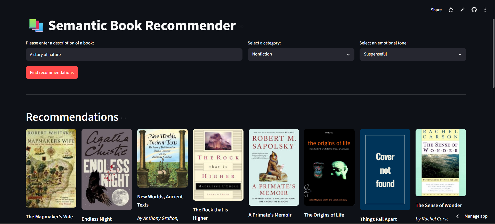
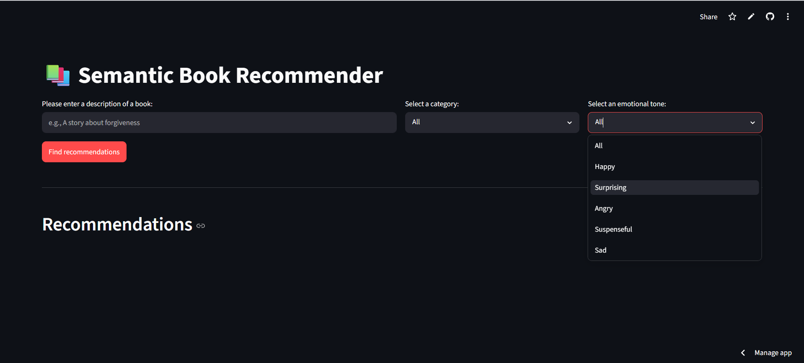
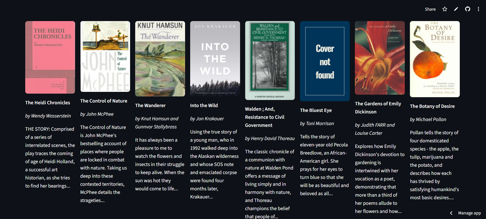

<div align="center">

# 📚 Semantic Book Recommender

[](https://semantic-book-recommendation.streamlit.app/)
[](https://github.com/ShahriarSajib/semantic_book_recommendation)
[](https://www.python.org/)
[](LICENSE)

_An AI-powered book discovery engine that understands the **themes**, **emotions**, and **context** behind your reading preferences — not just keywords._

**[🌐 Try the Live App](https://semantic-book-recommendation.streamlit.app/) · [📂 View Source](https://github.com/ShahriarSajib/semantic_book_recommendation)**

</div>

---

## 🖼️ Screenshots

<div align="center">
  
  
  
  <br/>
  <sub>Main Dashboard &nbsp;|&nbsp; Category Filtering &nbsp;|&nbsp; Emotion-Ranked Results</sub>
</div>

> 📌 **To add screenshots:** Create an `assets/` folder in the root of your repository and drop in `screenshot_dashboard.png`, `screenshot_filters.png`, and `screenshot_results.png`.

---

## ✨ Overview

The **Semantic Book Recommender** moves beyond traditional keyword-based search. It uses transformer-based NLP models to deeply understand the **thematic intent** and **emotional tone** of your query, then matches you to books that resonate on that level.

**Example query:** _"a gripping political thriller with moral ambiguity and a tragic ending"_

The engine parses what that _feels_ like — not just what it _says_ — and surfaces books accordingly.

**Key capabilities:**

- **Semantic Search** — Natural language queries matched against rich book descriptions via vector embeddings
- **Fiction / Nonfiction Classification** — Zero-shot categorization with no pre-labeled training data required
- **Emotion-Based Ranking** — Sort results by Joy, Sadness, Fear, Anger, or Surprise using per-book emotional tone scores
- **Interactive Filtering** — Refine results by category in a clean, performant Streamlit UI

---

## 🧠 Models & LLM Architecture

All models run **locally on your hardware** (CPU or CUDA GPU) with no API keys or token costs.

| Component                    | Model                                           | Purpose                                                                                             |
| ---------------------------- | ----------------------------------------------- | --------------------------------------------------------------------------------------------------- |
| **Semantic Embeddings**      | `BAAI/bge-small-en-v1.5`                        | Converts book descriptions and user queries into dense vector representations for similarity search |
| **Zero-Shot Classification** | `facebook/bart-large-mnli`                      | Classifies books into Fiction / Nonfiction without requiring labeled training data                  |
| **Emotion Analysis**         | `j-hartmann/emotion-english-distilroberta-base` | Assigns probability scores across 6 emotional tones per book for dynamic ranking                    |

---

## 🛠️ Tech Stack

| Layer                | Technology                                                                                                                         |
| -------------------- | ---------------------------------------------------------------------------------------------------------------------------------- |
| **Frontend**         | [Streamlit](https://streamlit.io/) — multi-column layout with session state caching                                                |
| **AI Orchestration** | [LangChain](https://www.langchain.com/) — document loaders, text splitters, model wrappers                                         |
| **Vector Store**     | [ChromaDB](https://www.trychroma.com/) — in-memory embedding storage and similarity search                                         |
| **Data Processing**  | [Pandas](https://pandas.pydata.org/) & [NumPy](https://numpy.org/) — metadata indexing over 7,000+ book records                    |
| **Deep Learning**    | [PyTorch](https://pytorch.org/) & [Hugging Face Transformers](https://huggingface.co/docs/transformers/) — model inference runtime |

---

## 📂 Project Structure

```
semantic_book_recommendation/
│
├── app.py                       # Main Streamlit application
├── requirements.txt             # Python dependencies
├── .env                         # Environment variable configuration (not committed)
│
├── data/
│   └── books_with_emotions.csv  # Preprocessed book metadata with emotion scores
│
├── assets/                      # README screenshots (add your own)
│
├── notebooks/
│   ├── data_cleaning.ipynb
│   ├── sentiment_analysis.ipynb
|   ├── text_classification.ipynb
│   └── vector_search.ipynb
|
└── README.md
```

---

## ⚙️ Local Setup & Installation

### Prerequisites

- Python 3.11 or 3.12
- pip
- _(Optional)_ NVIDIA GPU with CUDA 12.1+ for accelerated inference

---

### 1. Clone the Repository

```bash
git clone https://github.com/ShahriarSajib/semantic_book_recommendation.git
cd semantic_book_recommendation
```

### 2. Create Environment Configuration

Create a `.env` file in the project root:

```env
DATA_PATH="data/books_with_emotions.csv"
```

### 3. Install Dependencies

**For CPU environments:**

```bash
pip install -r requirements.txt
```

**For NVIDIA GPU (CUDA 12.1) environments:**

```bash
pip uninstall -y torch torchvision torchaudio
pip install torch torchvision torchaudio --index-url https://download.pytorch.org/whl/cu121
pip install -r requirements.txt
```

---

## 🚀 Running the App

```bash
streamlit run app.py
```

The app will be available at:

```
Local URL:   http://localhost:8501
Network URL: http://<your-local-ip>:8501
```

---

## 🌐 Live Deployment

The application is deployed on **Streamlit Community Cloud** and publicly accessible:

🔗 **[https://semantic-book-recommendation.streamlit.app/](https://semantic-book-recommendation.streamlit.app/)**

---

## 📄 License

Distributed under the **MIT License**. See [`LICENSE`](LICENSE) for details.

---

<div align="center">

Made by [ShahriarSajib](https://github.com/ShahriarSajib)

</div>
